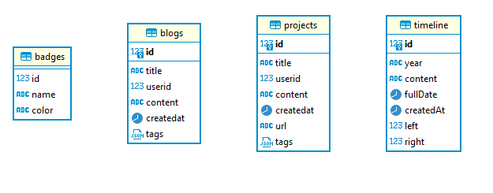

# Florian Hiso portfolio site

Build for the best professor that exist and will exist

## Info

The frontend was build with `Daisy UI` and `Typescript` on top of `React`.
It is deployed on netlify.

The backend was build with `Nodejs` and `Postgres` using `DBeaver` as a maintenance and access tool.
It is deployed on render.

A SQL file and instructions are provided for the DB structure.

## Install

Dependencies Nodejs 18.x.

To run frontend:

- `npm i`
- `npm run dev`

## Deployment

Frontend using netlify cli (needs to be installed globally)

- `npm run build`

- `ntl deploy --prod`

## External connection

To maintain the database we are using DBeaver. The connection can be done easily buy entering the required credentials provided by render instance.

## Backup

Backups are maintained every 90 days using DBeaver GUI or postgres CLI:

- Create the local dump file -> `pg_dump --no-owner -U postgres -d api > apiSql.sql`

- Connect to remote database to dump the local sql file

- `\c TempDatabase ` -> `Drop prodDatabase` -> `Create prodDatabase` -> `\c prodDatabase` -> `\i ./apiSql.sql`

## ERD

ERD diagram for the postgres instance:

Things to note here are:

- left and right show the completion of a timeline, specific year, using a tiny int as a boolean value
- tags are shown with a json object, the composition is as follows `name:color`

A dummy json tag would be:

`{"NLP":"badge-info"}`

The colors available are:

- badge-neutral
- badge-primary
- badge-secondary
- badge-accent
- badge-info
- badge-success
- badge-warning
- badge-error
- badge-outline

If they change or aren't enough, the following link is where you can find the source for these classes:
https://daisyui.com/components/badge/

## Enjoy 🥳

> for every ε>0, there exists a δ>0, such that if 0<|x−a|<δ, then |f(x)−L|<ε .
> QED

